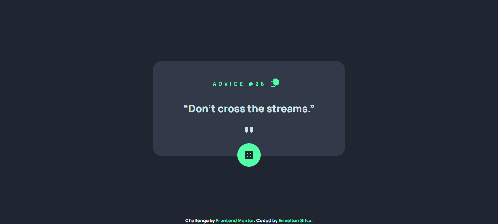

# Frontend Mentor - Advice generator app solution

This is a solution to the [Advice generator app challenge on Frontend Mentor](https://www.frontendmentor.io/challenges/advice-generator-app-QdUG-13db). Frontend Mentor challenges help you improve your coding skills by building realistic projects.

## Table of contents

-   [Overview](#overview)
    -   [The challenge](#the-challenge)
    -   [Screenshot](#screenshot)
    -   [Links](#links)
-   [My process](#my-process)
    -   [Built with](#built-with)
-   [Author](#author)

## Overview

### The challenge

Users should be able to:

-   View the optimal layout for the app depending on their device's screen size
-   See hover states for all interactive elements on the page
-   Generate a new piece of advice by clicking the dice icon

### Screenshot

### Links

-   Solution URL: [https://www.frontendmentor.io/solutions/advice-generator-app-main-using-vuejs-lq-c2AQfiy#comment-647432668cf70402ba372548](https://www.frontendmentor.io/solutions/advice-generator-app-main-using-vuejs-lq-c2AQfiy#comment-647432668cf70402ba372548)
-   Live Site URL: [https://advice-generator-app-main-eriveltonsilva.vercel.app](https://advice-generator-app-main-eriveltonsilva.vercel.app)

## My process

### Built with

-   Semantic HTML5 markup
-   Flexbox
-   CSS Grid
-   BEM
-   ITCSS
-   SASS
-   [Vue.js](https://vuejs.org/) - JS Framework

## Author

-   Frontend Mentor - [@eriveltondasilva](https://www.frontendmentor.io/profile/eriveltondasilva)
-   Instagram - [@erivelton.dsilva](https://www.instagram.com/erivelton.dsilva/)
-   Twitter - [@EriveltonDSilva](https://twitter.com/EriveltonDSilva)
